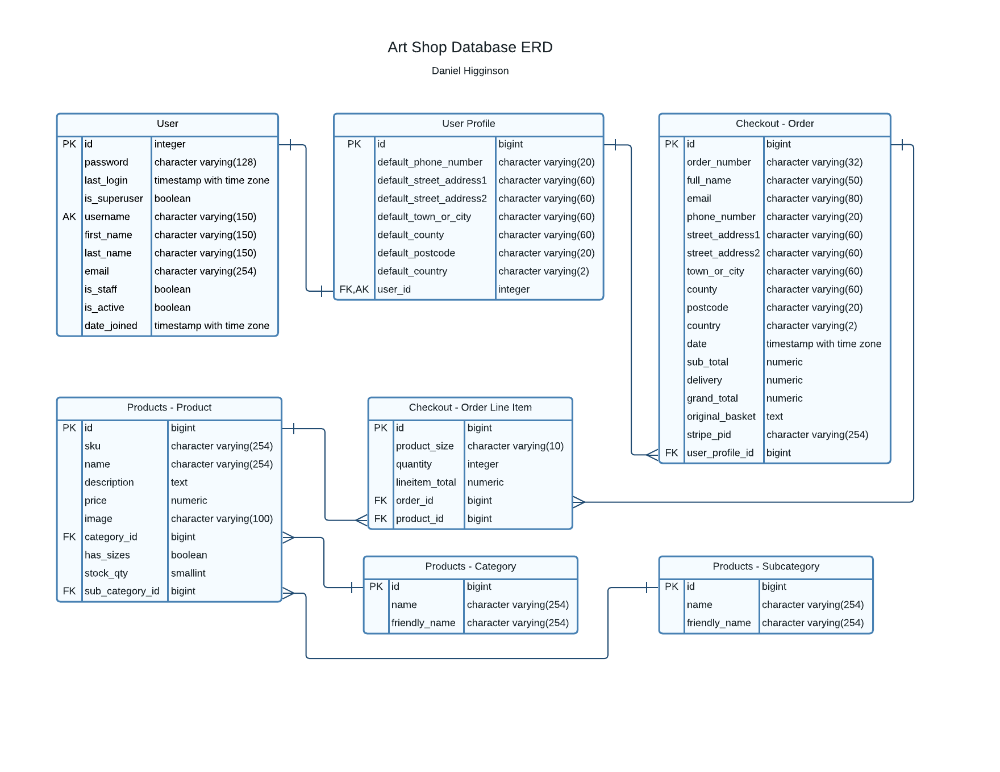

<h1 align="center"><strong>Art Shop</strong></h1>

View live site [here.](https://danbob81-art-shop.herokuapp.com/)


# **User Experience (UX)** 

## **Brief**
Local artist Lindsey Higginson wishes to showcase and sell her artwork online. She requires a website that will enable her to do just that. The site is to be clean and modern looking and needs to accept online credit card payments. It also needs the facility to easily update, add and remove items within the shop if/when required.


#
## **User Stories**

**Viewing and Navigation**
  - As a shopper:
    - I wish to navigate the site intuitively
    - I wish to get visual feedback on completion of all actions
    - I wish to view all products clearly so that I can choose what to buy
    - I wish to view full product information of a specific product, including the product image, description, price, sizes (if any)
    - I wish to easily see my basket total to see how much I am spending

**Registration and User Accounts**
  - As a site user:
    - I wish to create an account to store my order history and personal details including shipping address for future purchases
    - I wish to easily log in so that I can access my profile and manage my personal details
    - I wish to easily log out when I have finished using the site
    - I wish to be able to request a password reset via email in case of have forgotten it

**Purchasing and Checkout**
  - As a shopper:
    - I wish to purchase items as a guest so that I can checkout without having to create an account
    - I wish to be able to easily add items, update quantity, or remove items in the basket before checkout
    - I wish to be confident that my payment and personal information are secure during the checkout process
    - I wish to be able to easily enter my payment information
    - I wish be able to view a summary of my order at checkout before completing my purchase
    - I wish to recieve a confirmation email for my purchase showing the order details so I can be confident the purchase has been made successfully

**Admin and Store Management**
  - As the Store Owner:
    - I wish to be able to easily add new products to my store
    - I wish to be able to easily view and edit products to update their details or quantity information
    - I wish to be able to delete products that I no longer wish to sell in my store

[Back to top](#user-experience-ux)

#
## **Design**
### **Colour Scheme:**
  - Monochromatic black and white scheme with the only colour coming from the logo, artwork images in the gallery and shop products.

### **Typography:**
  - Google Fonts
    - Main text - [Raleway](https://fonts.google.com/share?selection.family=Raleway)

### **Imagery**
  - [Font Awesome](https://bit.ly/3tfSjJN) used for icons throughout
  - [Canva](https://bit.ly/3Ol5jGJ) was used to create the logos in the header and footer of the site
  - Images in the Welcome, Gallery and Originals section of the shop are scans of original artworks by Lindsey Higginson
  - Images in the Prints and Merchandise sections of the shop are from [RedBubble](https://rdbl.co/3xHi7Ro)


### **Wireframes**

Wireframes for desktop, tablet and mobile views created using Balsamiq.

PDF links here:
  - [Desktop]()
  - [Tablet]()
  - [Mobile]()

[Back to top](#user-experience-ux)

#
## **Features**

### **Implemented**

**All users:**
  - Header, to display consistently throughout, containing:
    - logo
    - main nav and mobile nav showing:
      - Home
      - Gallery
      - Shop - with dropdown menu linking to:
        - Prints
        - Originals
        - Merchandise
    - Sign In/My Account - with dropdown menu linking to:
      - Product Management (admin/superuser only)
      - My Profile
      - Sign Out
    - Basket - showing the basket total cost when items are in the basket
  - Welcome page featuring an image and 'about me' text with external link to Instagram
  - Gallery page featuring images of artwork
  - Shop page featuring links to three products pages for:
    - Prints
    - Originals
    - Merchandise
  - Products pages displaying products which link to:
    - Product details page displaying the individual products information and options to choose quantity and size if available, and add to basket
  - Shopping basket page displaying items in the basket with basket subtotal and options to update quantity or remove item. Also links to Checkout or back to Shop
  - Checkout displaying item(s), a form to enter information including shipping address, payment section and Complete Order button
  - Order confirmation page displaying the order information for purchase immediately made
  - Profile page displaying logged in users information, with ability to amend their information, and order history
  - Log out redirects user back to home page
  - Footer, to display consistently throughout, featuring a disclaimer, copyright and social media links

**Admin/Superuser only:**
  - Product Management page displaying list of all products, links to Edit Product page, and Add Product form
  - Edit Product page displaying a preview of the product being edited and a form to edit the product, which includes option to delete the product also

### **Future features**
  - Improve gallery page with option for store owner to add/remove images/collections of images
  - Option for a user to delete their account
  - Option for the store owner to add, edit and delete categories and/or subcategories
  - Contact page


[Back to top](#user-experience-ux)

#
## **Database Design**
### **Entity Relationship Diagram**




(created using LucidChart - [link](https://bit.ly/3qHI00n))

[Back to top](#user-experience-ux)

#
## **Technologies Used**

### **Languages:**
  - HTML 5
  - CSS 3
  - Javascript (JQuery)
  - Python

### **Frameworks, libraries and programmes:**
  - Bootstrap - for layout and responsiveness
  - JQuery - for JS functions
  - Pip - to install required dependencies
  - Jinja - to auto-populate the site with database contents
  - Crispy forms - to manage Django forms
  - Django-countries - for its pre-built country field containing the valid country codes
  - Gunicorn - for WSGI HTTP Server to support deployment of Django application
  - Stripe.js - library for handling Stripe payment objects
  - Git & Github - for version control and code storing
  - Balsamiq - for wireframes
  - LucidChart - for entity relationship diagram
  - Heroku - to deploy live site

### **Database Technologies and Cloud Storage**
  - sqlite3 in Django development environment
  - PostgreSQL (Heroku Postgres) in deployment
  - Amazon AWS S3 to host all images and static files

### **Workspace**
  - Gitpod - VSCode based virtual IDE

[Back to top](#user-experience-ux)

#
## **Testing**

Chrome Developer Tool was used to simulate the different viewport sizes for desktop and laptop views, tablet views and mobile views. I used this throughout the development process as well as for testing the website once it was deployed to Heroku.

The deployed website was also tested using Chrome, Edge and Firefox as well as on mobile (using Chrome for Android on Huawei P30)

More detailed information of the testing carried out can be viewed in [TESTING.md](TESTING.md)

[Back to top](#user-experience-ux)

#
## **Deployment**

### **Site deployed to Heroku**
### Requirements for Deployment

* An IDE (such as GitPod or VSCode)
* Git - for version control
* GitHub account
* Python3
* PIP - for Python package installation
* Heroku account
* AWS S3 account
* Stripe account
* Email account

#### This project was deployed in two stages:
### 1. Initial Deployment 
_Create an Heroku app, connect to Postgres database and deploy the app without static files._

* Gitpod Local environment
  | KEY         | VALUE |
  | ----------- | ----------- |
  | DEVELOPMENT | True |
    
* Create an env.py file in gitpod

    ```
  import os

  os.environ["SECRET_KEY"] = "#YOUR_SECRET_KEY#"
  os.environ["STRIPE_PUBLIC_KEY"] = "#YOUR_STRIPE_PUBLIC_KEY#"
  os.environ["STRIPE_SECRET_KEY"] = "#YOUR_STRIPE_SECRET_KEY#"
  os.environ["DATABASE_URL"] = "#YOUR_DATABASE_URL#"
  os.environ["STRIPE_WH_SECRET"] = "#YOUR_STRIPE_WH_SECRET#"
  os.environ["AWS_SECRET_ACCESS_KEY"] = "#YOUR_AWS_SECRET_ACCESS_KEY#"
  os.environ["AWS_ACCESS_KEY_ID"] = "#YOUR_AWS_ACCESS_KEY_ID#"
  os.environ["USE_AWS"] = True
  os.environ["EMAIL_HOST_PASS"] = "#YOUR_EMAIL_APP_PASS_CODE#"
  os.environ["EMAIL_HOST_USER"] = "#YOUR_EMAIL_ADDRESS#"
  ```

* To deploy this application on Heroku, Heroku needs to understand what dependencies are required, as well as which files to run for this project.
  * Create a requirements file: in the terminal type the following command:
    * `pip3 freeze --local > requirements.txt`
    * This file will hold a list of all dependencies required for this project.
  * Create a procfile: in the terminal type the following command:
    * `echo web: python run.py > Procfile` 
    * Make sure there is no blank line after the contents of this file.
* Commit and push these changes to GitHub.
* Login or sign up to [Heroku](https://www.heroku.com).
* Select '**Create New App**' in the top right of your dashboard.
* Choose a unique app name, and select the region closest to you, then click '**Create App**'.
* Go to the '**Deploy**' tab, find '**Deployment Method**', and select '**GitHub**'.
* Find your GitHub repository, and click '**Connect**'.
* Navigate to the '**Settings**' tab and click '**Reveal Config Vars**'.
* Enter key-value pairs that match those in your project files for the keys below:
  | KEY                   | VALUE                   |
  | --------------------- | ----------------------- |
    SECRET_KEY            | YOUR_SECRET_KEY
    STRIPE_PUBLIC_KEY     | YOUR_STRIPE_PUBLIC_KEY
    STRIPE_SECRET_KEY     | YOUR_STRIPE_SECRET_KEY
    DATABASE_URL          | YOUR_DATABASE_URL
    STRIPE_WH_SECRET      | YOUR_STRIPE_WH_SECRET
    AWS_SECRET_ACCESS_KEY | YOUR_AWS_SECRET_ACCESS_KEY
    AWS_ACCESS_KEY_ID     | YOUR_AWS_ACCESS_KEY_ID
    USE_AWS               | YOUR_USE_AWS
    EMAIL_HOST_PASS       | YOUR_EMAIL_HOST_PASS
    EMAIL_HOST_USER       | YOUR_EMAIL_HOST_USER
    DISABLE_COLLECTSTATIC | 1 (Add this variable temporarily)

* In Heroku, navigate to the '**Resources**' tab, and add on '**Heroku Postgres**' with the free plan.
* Back up your current sqlite database:
  * As this database was designed without fixtures, make sure manage.py file is connected to mysql database.
  * Backup the current database for each of desired model and load it into a db.json file: in the terminal type the following command:
  `python3 manage.py dumpdata your_model_name > db.json`
  * Repeat this action for each model you wish to transfer to the postgres database (alternatively you can backup your whole database)
* Load data from db.json file into postgres:
  * Create a temporary variable in your environement named: DATABASE_URL with the value of the Postgres URL from Heroku
  * Install the following packages and freeze the requirements: in the terminal type the following commands:
    * `pip3 install dj_database_url`
    * `pip3 install psycopg2-binary`
    * `pip3 freeze > requirements.txt`
  * In art-shop > settings.py, add `import dj_database_url` at top of the page
  * Connect your manage.py file to your postgres database  
    ```
    DATABASES = {
    'default':  dj_database_url.parse('DATABASE_URL')
    }
    ```
* Load your data from the db.json file into postgres: in the terminal type the following command:
  * `python3 manage.py loaddata <your_file>.json`
  * (if you have backed up several json files, repeat this action for each file)
* Make migrations to start using PostgreSQL: in the terminal type the following commands:
  * `python3 manage.py makemigrations`
  * `python3 manage.py migrate`
* Create a superuser to access the Django admin panel: in the terminal type the following command:
  * `python3 manage.py createsuperuser`
  * then add a username and password in the terminal
* Install the Heroku CLI and login: in the terminal type the following command:
  * `heroku login` or `heroku login -i`
* Remove `DISABLE_COLLECTSTATIC = 1` from your heroku config vars.
* Commit and push changes to GitHub.
* Add the hostname of your Heroku app to '**ALLOWED HOSTS**' in your settings.py file. This can be found in Heroku Settings > App Name.
* Navigate to the '**Deploy**' tab on your Heroku apps Dashboard, and click on '**Enable Automatic Deployment**'.
* Click open app to view the application in your browser, your app should display without any images and static files at this stage.

### 2. Amazon AWS
_Create and connect an Amazon bucket for storing images and static files._
#### S3 Bucket:
* Create a new bucket, give it a name, and choose the region closest to you.
* Go to 'Properties', turn on static website hosting, and type _index.html_ and _error.html_ for the index document & error document fields and save.
* Go to 'Permissions', and add the code block underneath this section into your CORS config to link Heroku and your S3 bucket.
* Go to the 'Permissions' tab and click on 'CORS configuration'.
* To link Heroku and your S3 bucket, paste in the following code into the area provided:
```
  [
  {
    "AllowedHeaders": [
      "Authorization"
    ],
    "AllowedMethods": [
    "GET"
    ],
    "AllowedOrigins": [
    "*"
    ],
    "ExposeHeaders": []
    }
  ]
```
* Still in the 'Permissions' tab, click 'Edit' on the 'Bucket Policy' and open the 'Policy Generator'.
* Use the following settings to setup the policy correctly:
  * _Type of Policy: 'S3 Bucket Policy'_
  * _Principal: '*' to allow all principles_
  * _Action: 'Get Object'_
  * _Amazon Resource Name (ARN): Paste your Bucket ARN and add * at the and of your Bucket Resource key arn:aws:s3:::bucket_name/_ 
  * Click 'Save'
* Still in the 'Permissions' tab, go to the 'Access Control List', Set the list of objects permission for everyone under the 'Public Access' section.

#### IAM
* Click on the 'Services' tab on the top left of the page and search for 'IAM'.
* Go to '**User Groups**', '**Create New Group**', enter a name, and click '**Create**'.
* Go to '**Policies**', '**Create New Policy**', '**JSON**', '**Import Managed Policy**', '**S3**', '**AmazonS3FullAccess**', '**Import**'.
* Get your ARN from '**S3 Permissions**', delete the `*` from '**Resource**', and add the code block underneath this section into the area.
* Click '**Next**', '**Review**', provide a name and description, and click '**Create Policy**'.
* Go to '**User Groups**', '**Find New Group**', '**Permissions**', '**Add Permissions**', '**Attach Policies**', find the policy you created, and click '**Add Permissions**'.
* Go to '**Users**', provide a name, and tick the checkbox beside '**Access key - Programmatic access**'.
* Click '**Next**', select the group you created in step 1, and click through to the end.
* Finally, click '**Create User**', and download the CSV file, which will contain your `AWS_SECRET_ACCESS_KEY` and your `AWS_ACCESS_KEY_ID`. This is the only time that this CSV file will be available, so it's very important to download it at this stage.

```python
"Resource": [
    "{YOUR ARN}",
    "{YOUR ARN}/*"
]
```

#### Final AWS Steps:
* Navigate to S3, you'll see that you have a '**static**' folder with all your static files in it.
* Create a '**media**' file in your S3 Bucket, click '**Upload**'.
* Click '**Add Files**', then add all your product images.
* Under '**Manage Public Permissions**', select '**Grant Public Read Access**'.
* Then click '**Upload**'.
* Finally, attempt to log in to the site using the superuser details, then access the '**admin**' panel on the live site, go to '**Email Addresses**', and select Primary and Verified on the superuser email address.


[Back to top](#user-experience-ux)

#
## **Credits**

### **Content:**
  - Welcome information on home page written by Lindsey Higginson

### **Code:**
  - [Code Institute](https://bit.ly/3A2Nwk3):
    - A large amount of the code used came from the Boutique Ado Walkthrough project by Chris Zielinski
  - [Stack Overflow](https://bit.ly/3bbL93V) used in figuring out django errors and code including:
    - reduce stock quantity when an order is made - [link](https://bit.ly/3QygMog)
    - how to keep the footer at the bottom of the page - [link](https://bit.ly/39xCMPw)
  - [Programming with Mosh](https://bit.ly/3xZJVBM) - YouTuber Mosh Hamadani's Django course for helping me get more of an understanding of how Django works

 
### **Media:**
  - All original artwork images used in the site created by Lindsey Higginson
  - Images used in Prints and Merchandise section of the shop taken from [RedBubble](https://rdbl.co/3xHi7Ro)
  - [Canva](https://bit.ly/3N3zEsk) used for creating site logos

### **Acknowledgements:**
- Code Institue tutors and the students and mentors in the CI Slack Community for the help and guidance when needed
- Patrick Justus, Tutor at Harlow College for the additional guidance provided along the way
- Thank you to my wife and son for their support and immense patience while I have been 'absent' during this project

[Back to top](#user-experience-ux)
#