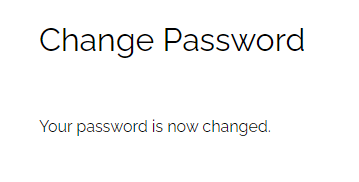

#  **Testing**

Back to [README.md](README.md)

View live site [here.]()

# 
The site has been tested using Google Chrome, Mozilla Firefox and Microsoft Edge on desktop/laptop as well as Chrome on Android mobile. The Google Developer tool has been used to check the sites responsiveness across various screen sizes (desktop, tablet, mobile).
# 

## **User Story Testing**

**Viewing and Navigation**
  - As a shopper:
    - I wish to navigate the site intuitively
        - The navigation bar is displayed clearly and is easy to understand taking the user to where they expect to be in the site
        - 
        - The Account dropdown menu displays differently according to a users access
        - 
          
          

        - Clicking on the logo takes the user back to the Home page
        - Buttons are clearly defined and uniform throughout, also giving visual feedback to the user when hovered over or clicked on
        -  

    - I wish to get visual feedback on completion of all actions
        - Toast messages are displayed to show:
            - Success 
            - Error
            - Info
            - Warning
            -  
        - Validation messages display on all forms

    - I wish to view all products clearly so that I can choose what to buy
        - Products are clearly displayed and if an item is sold out, a badge displays on the product image to indicate that
        - 
    - I wish to view full product information of a specific product, including the product image, description, price, sizes (if any)
        - Product information clearly displayed including an indicator of stock quantity when low
        - 
    - I wish to easily see my basket total to see how much I am spending
        - Basket total is displayed under the basket icon in the top right corner of every page and is updated with each new item added
        - 

**Registration and User Accounts**
  - As a site user:
    - I wish to create an account to store my order history and personal details including shipping address for future purchases
      - A user register for an account by clicking Register in the dropdown menu top right of the page
      - 
      - The user is taken to a Sign Up form; when they click Sign Up, a message informs that a confirmation email was sent to them asking them to confirm their email address; the link takes the user to the Confirm Email Address page.
      - 
    - I wish to easily log in so that I can access my profile and manage my personal details
      - A user can log in from the dropdown menu. Once logged in they can select My Profile from the same dropdown menu which takes them to the Profile page. There they can update their personal information, including delivery address, and also view their Order History
      -  
    - I wish to easily log out when I have finished using the site
      - A user can click Logout in the My Account dropdown which takes them to a confirmation page
      - 
    - I wish to be able to request a password reset via email in case of have forgotten it
      - A user can click Forgot Password? in the Sign Up page. This will take them to a page asking them to enter their email address. When they recieve the email, they must click the link in the email which takes them to a page where they can enter a new password; clicking on the Change Password button then takes them to a confirmation page telling them the password was successfully changed. After that the can sign in like usual
      -    

**Purchasing and Checkout**
  - As a shopper:
    - I wish to purchase items as a guest so that I can checkout without having to create an account
      - A guest user can purchase items without registering
    - I wish to be able to easily add items, update quantity, or remove items in the basket before checkout
      - The item quantity can be adjusted in the Product Detail page
      - The basket can be updated with items added, quantity adjusted or items removed before checkout
      - Visual feedback is given for any changes made via toast messages
      -  
    - I wish to be confident that my payment and personal information are secure during the checkout process
      - Stripe is used to handle all card payments on this site. Stripe is certified to PCI Service Provider Level 1, which is the most stringent level of certification available in the payments industry. All card numbers are encrypted with AES-256 (Advanced Encryption Standard - 256 bits), and decryption keys are stored on separate machines.
    - I wish to be able to easily enter my payment information
      - The place to enter payment information is clearly labelled along with the personal information and shipping address form
      - 
    - I wish be able to view a summary of my order at checkout before completing my purchase
      - An order summery is displayed in the Checkout with a link to amend the order if necessary which takes the user back to the Basket page
      - 
    - I wish to recieve a confirmation email for my purchase showing the order details so I can be confident the purchase has been made successfully
      - A confirmation email is sent to the user when they have clicked Complete Order in the checkout. A toast message is displayed telling the user that the email has been sent
      - 

**Admin and Store Management**
  - As the Store Owner:
    - I wish to be able to easily add new products to my store
    - I wish to be able to easily view and edit products to update their details or quantity information
    - I wish to be able to delete products that I no longer wish to sell in my store

[Back to top](#testing)

#
## **Validator testing:**
### **HTML - [W3C Validator](https://bit.ly/3vkSIx1)** - *passed*

#
### **CSS - [(Jigsaw) validator](https://bit.ly/3F29Zg1)** - *passed*

#
### **Javascript - [JSHint](https://bit.ly/3jRVMKH)** - *passed*

#
### **Python - [Pep8](https://bit.ly/3qXj7hD)** - *passed*

[Back to top](#testing)

#
## **Additional testing:**
Black box testing was also carried out on the final deployed website.
    
All tests passed. Results can be viewed [here]()

#
## **Bugs**

**Found and corrected**

**No known bugs left unfixed**

[Back to top](#testing)